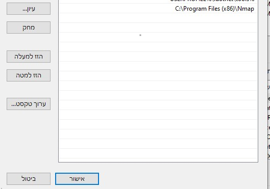

## Layer 2 Scan_network_devices ##

Tool to discover devices in your network using nmap -> python.


## Dependencies ##

* Python 3+
* nmap
*requirements file
* IPython
## Installation Part 0 ##

1. install nmap :
	run file on the directory or form : [namp page](https://nmap.org/download.html)
2. add nmap to the windows path : enter the windows path and add -> C:\Program Files (x86)\Nmap
	

## Installation Part 1 ##

```
1. pip install requirements 
1.1 pip install IPython
```

## Usage ##

```
run the python file
on the run the code will ask for the Default Getway (your router inner ip)
usually it 192.168.1.1 so if keep without tyoing it will take that getway
```